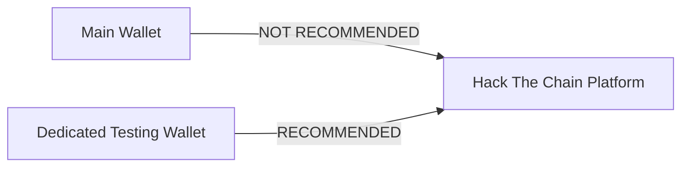
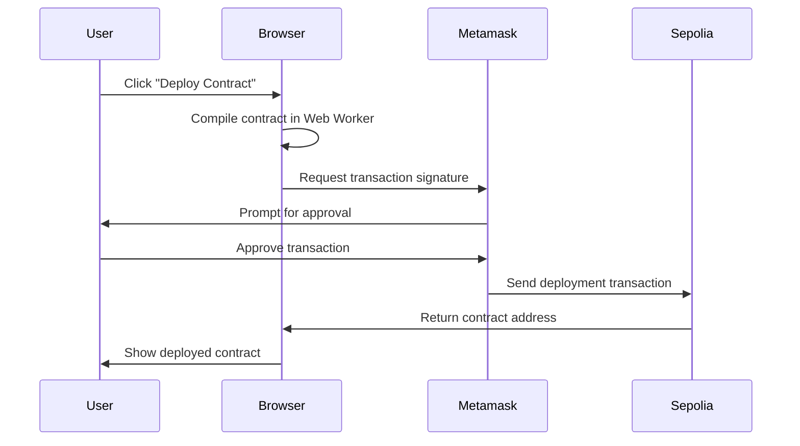

This guide will help you configure everything you need to successfully use the Hack The Chain platform for smart contract security challenges.

## Prerequisites

Before you begin, you'll need to set up a few things:

1. A modern web browser (Chrome, Firefox, or Brave recommended)
2. Metamask wallet extension
3. Access to the Sepolia test network
4. A small amount of Sepolia testnet ETH

## Metamask Configuration

### Installing Metamask

If you don't already have Metamask installed:

1. Visit [metamask.io](https://metamask.io/) and download the browser extension
2. Follow the setup instructions to create a new wallet
3. **Important**: For security reasons, we strongly recommend creating a separate wallet specifically for development and testing purposes, rather than using your main wallet that holds real assets

### Creating a Testing Wallet

Since Hack The Chain (like all third-party DApps) requires wallet connection:

1. Click your account icon in Metamask
2. Select "Create Account" or "Import Account"
3. Name it something like "Testing Wallet" or "Dev Wallet"
4. Use this wallet for all development and testing purposes

## Connecting to Sepolia Network

Hack The Chain exclusively uses the Sepolia testnet for all smart contract interactions. You'll need to:

1. Open Metamask
2. Click the network dropdown at the top (usually says "Ethereum Mainnet")
3. Select "Display test networks"
4. Choose "Sepolia"

You can also add the network manually
1. Select "Add Network" or "Custom RPC"
2. Input the following details:

| Setting | Value |
|---------|-------|
| Network Name | Sepolia Test Network |
| New RPC URL | https://rpc.sepolia.org |
| Chain ID | 11155111 |
| Currency Symbol | ETH |
| Block Explorer URL | https://sepolia.etherscan.io |

If you're using The Hack Chain, when you launch an exercise, you'll automatically be prompted to switch to Sepolia if you're using another network.

## Obtaining Sepolia Testnet ETH

You'll need a small amount of Sepolia ETH (minimum 0.01 ETH) to deploy contracts and interact with the platform. You can get free testnet ETH from these faucets:

- [Alchemy Sepolia Faucet](https://www.alchemy.com/faucets/ethereum-sepolia) - Requires Alchemy account
- [Infura Sepolia Faucet](https://www.infura.io/faucet/sepolia) - Requires Infura account
- [Google Sepolia Faucet](https://cloud.google.com/application/web3/faucet/ethereum/sepolia)
- [Sepolia PoW Faucet](https://sepolia-faucet.pk910.de/)

## How CodeAudit Works

### Browser-Based Compilation

CodeAudit compiles smart contracts directly in your browser:

1. The Solidity compiler (solc-js) is loaded as WebAssembly
2. Compilation happens in a Web Worker to avoid browser memory limitations
3. The compiled bytecode is then used with Metamask for deployment
4. No contract code is sent to external servers for compilation

### Deployment Process

### Verification Process

When you attempt to exploit a vulnerability:

1. Your solution is tested against the deployed contract on Sepolia
2. The verification is performed through client-side JavaScript
3. The test runs entirely in your browser using your wallet connection
4. Results are processed locally and displayed immediately

## Security Considerations

- **Never use your main wallet** containing real assets for educational platforms
- Always verify transaction details before confirming in Metamask
- Contract deployment and interaction will consume small amounts of testnet ETH
- No real funds are at risk, but practicing good security habits is important

---

With these steps completed, you'll be ready to start learning and practicing smart contract security through interactive challenges on Hack The Chain!
